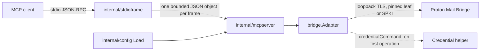
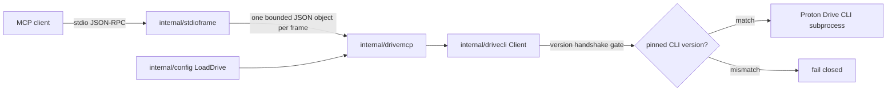

# Architecture

Croton is two stdio Model Context Protocol (MCP) executables over two
independent adapters. They share only a secure configuration opener, a
strict JSON decoder, and one bounded stdio frame limiter. This page is the map: the process shapes with their trust
chains, every package with its role and what it must never do, where each
statement of the product vision is realized in the tree, and what deliberately
lives outside the module.

Tool contracts live in [docs/MCP.md](MCP.md) (Mail) and
[docs/DRIVE-MCP.md](DRIVE-MCP.md) (Drive); trust boundaries and residual risks live in
[docs/THREAT_MODEL.md](THREAT_MODEL.md); deployment steps live in
[docs/DEPLOYMENT.md](DEPLOYMENT.md). This page does not restate them.

## Product form

- Local stdio MCP servers, usable by any standards-compatible MCP client.
- Mail and Drive are separately runnable: separate executables, separate
  configuration schemas, separate credential or authentication boundaries, and
  separate tool registries.
- A Go implementation with a reusable, MCP-neutral Proton Mail Bridge adapter.
- An independent, unofficial community project, not affiliated with or
  endorsed by Proton AG.
- A public, installable open-source product. Account material and personal
  automation stay outside the module.

## Processes

Each process is one chain from an MCP client to one Proton service. The two
chains share no adapter, credential path, or gate. Both enter through the same
bounded frame reader in `internal/stdioframe`, so neither can diverge on what
a stdio frame is.

### `croton-mcp` (Mail)

`cmd/croton-mcp` loads one Mail configuration through `internal/config`,
constructs the six-tool server in `internal/mcpserver`, and serves it over
stdio. The server owns the MCP catalog; `bridge.Adapter` owns exactly one
authenticated read-only IMAP session and does not dial the Bridge or run the
credential command until the first operation. The connection is loopback-only
over TLS with explicit trust material; certificate-authority bundles are
rejected. The six tools are listed in [docs/MCP.md](MCP.md#tools).

### `croton-drive-mcp` (Drive)

`cmd/croton-drive-mcp` loads one Drive configuration through `internal/config`,
constructs the server in `internal/drivemcp`, and serves it over stdio. The
adapter in `internal/drivecli` is the fail-closed subprocess boundary around
the operator-installed Proton Drive CLI: every data command is gated behind a
successful exact-version `version` handshake. The server never touches
credentials; the CLI's own credential store does.

The frozen CLI surface is `drivecli.AllowedCommandLines()`, reproduced here:

| Allowed command line | Adapter method | MCP tool |
| --- | --- | --- |
| `version` | `Handshake` | none (the gate) |
| `filesystem list <path> [--type file\|folder] --json` | `List` | `list_drive_entries` |
| `filesystem info <path> --json` | `Info` | `get_drive_metadata` |
| `filesystem download <remotePath...> <localFolder> --file-conflict-strategy skip --folder-conflict-strategy skip --json` | `Download` | none: adapter-supported, exposed by no MCP tool |
| `sharing status <path> --json` | `SharingStatus` | `get_drive_sharing_status` |

The allowlist is not the MCP catalog. The catalog is `toolDefinitions()` in
`internal/drivemcp/tools.go`, which registers exactly three tools:
`list_drive_entries`, `get_drive_metadata`, and `get_drive_sharing_status`.
`filesystem download` is allowlisted and `drivecli.Client.Download` exists,
but no tool calls it; local confinement through `allowedDownloadDirectories`
is reserved.

## Packages

Every directory holding tracked Go source, its role, and the line it must
never cross. The role column follows the package doc comments.

| Package | Role | Must never |
| --- | --- | --- |
| `bridge` | Bounded, read-only, MCP-neutral connection boundary and mail normalization primitives for Proton Mail Bridge; `Adapter` serializes one authenticated read-only IMAP session. | Import MCP types, add a mutating IMAP operation, or connect anywhere but loopback over TLS. |
| `cmd/croton-mcp` | The Mail stdio executable: loads one Mail configuration and serves the six read-only mail tools. | Write anything but protocol to stdout, or link the Drive server. |
| `cmd/croton-drive-mcp` | The Drive stdio executable: serves Croton Drive's independent MCP lifecycle. | Write anything but protocol to stdout, link the Mail server, or read a Proton password. |
| `internal/config` | Secure configuration opener shared by the Mail and Drive schemas; one descriptor-relative, no-follow `load` path both `Load` and `LoadDrive` use. | Offer a path-based fallback open, follow a symlink, or accept a file readable by group or world. |
| `internal/drivecli` | Bounded Proton Drive CLI subprocess adapter; `Client` is the fail-closed boundary that runs only the frozen allowlist after an exact-version handshake. | Run a command line outside `AllowedCommandLines()`, skip the handshake, or handle Proton credentials. |
| `internal/drivemcp` | Croton Drive's independently runnable MCP server and its three-tool catalog. | Register a write-capable or download tool, share an adapter with Mail, or return a public link's password. |
| `internal/mcpserver` | Croton's Mail MCP server: the six-tool catalog, bounded argument decoding, and the stdio transport. | Register a mutating tool, expose attachment bytes, or add Roots, Sampling, or MCP Logging. |
| `internal/stdioframe` | The bounded newline-delimited stdio transport shared by every Croton executable: each inbound frame is proven to be one strictly decoded JSON object within the 64 KiB ceiling before the SDK sees it. | Pass an oversize or ambiguous frame to the SDK, close standard output, or write anything but JSON-RPC to it. |
| `internal/strictjson` | Bounded, unambiguous JSON decoding shared by both servers. | Accept duplicate keys, trailing values, or unbounded input. |
| `internal/testkit` | Deterministic IMAP and Proton Drive CLI fixtures: a synthetic loopback IMAP server and the fake-Drive builder. | Contain live account material, or be imported by non-test code. |
| `internal/testkit/fakedrive` | The credential-free Proton Drive CLI stand-in executable for tests. | Contact a network or hold real credentials. |

## Vision to tree

Each product-form statement and where it is realized. "Reserved" means the
boundary exists in the tree but nothing ships behind it, with no date.

| Statement | Where |
| --- | --- |
| Local `stdio` MCP servers usable by standards-compatible clients | `cmd/croton-mcp`, `cmd/croton-drive-mcp` over the shared `internal/stdioframe` transport; stdout is protocol-only, diagnostics go to stderr; client-neutral contract exercised in CI against synthetic fixtures. |
| Mail and Drive `separately runnable` with separate configuration, credentials or authentication boundaries, and tool registries | Two executables; `config.Load` and `config.LoadDrive` decode separate schemas; Mail authenticates via `credentialCommand` in `bridge`, Drive via the CLI's own store behind the `internal/drivecli` handshake; catalogs in `internal/mcpserver` and `internal/drivemcp/tools.go`. |
| Go implementation with a reusable, `MCP-neutral` Mail Bridge adapter | `bridge` imports no MCP types; `internal/mcpserver` is its only in-tree consumer. |
| Independent, `unofficial` community project | README's Drive section and the non-affiliation statement; no Proton logos or branding in the tree. |
| Public, installable open-source product with `account material` and personal automation kept outside | Apache 2.0 `LICENSE`; `SECURITY.md` sensitive-data rules; only synthetic `.test` fixtures in `internal/testkit`; see "Outside the module". Reserved: Drive download (`Download` exists, no tool, `allowedDownloadDirectories` unused), sharing mutation, writes (`writes.enabled` defaults to disabled), and additional Proton services. |

## Outside the module

These deliberately live elsewhere and have no path in this tree:

- Digest scheduling and delivery. `select_digest_candidates` selects metadata;
  composing, timing, and sending a digest is personal automation.
- Calendar and every Proton service other than Mail and Drive.
- Account material: Proton credentials, account identifiers, mailbox and Drive
  contents, Bridge certificates, and unredacted protocol logs.
- Factory tooling: the credential helper, the Proton Drive CLI, Proton Mail
  Bridge, secret enrollment, and the deployment host described in
  [docs/DEPLOYMENT.md](DEPLOYMENT.md).
